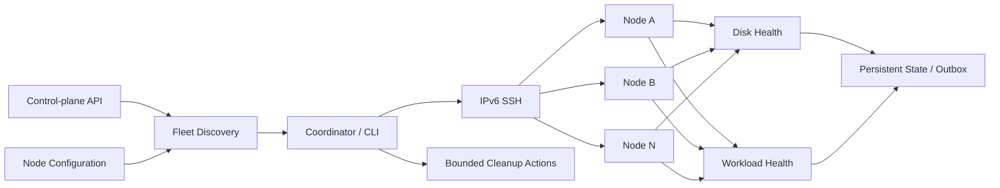

# Edge Fleet Ops Automation

[](#)
[](#)
[](#)
[](#status)

**English** · [简体中文](README.zh-CN.md)

Stateful Linux edge-fleet monitoring, disk-health auditing, workload checks, and conservative operations automation.

This repository is a sanitized portfolio reconstruction of tooling originally built to operate a small fleet of Linux edge nodes. The private scripts evolved around real operational problems: changing IPv6 addresses, heterogeneous storage, disk pressure, container health, long-running scheduled jobs, remote execution, and noisy or duplicated alerts.

The public version preserves those engineering patterns while removing credentials, device IDs, internal endpoints, site labels, workload-provider details, and production-specific repair logic.

## Why this project

Managing several remote Linux nodes becomes difficult once each machine has different storage, addresses can change, scheduled jobs overlap, and “healthy” cannot be reduced to a single ping.

The toolkit therefore models each node as a combination of **discovery, remote execution, disk health, workload health, persistent state, and bounded operational actions**. It is intentionally conservative: public self-healing logic is dry-run-first, remote access uses SSH keys, and destructive repair is excluded.

## What it demonstrates

- **Fleet discovery:** resolve node identifiers to live IPv6 candidates through a control-plane API, with configured fallbacks.
- **Remote operations:** key-based IPv6 OpenSSH across multiple Linux nodes.
- **Disk-health auditing:** filesystem pressure plus SMART, NVMe, and eMMC health signals.
- **Workload health:** combine Docker state, process state, established TCP connections, and socket counts.
- **Stateful alerting:** persist transition state and an outbox so alerts are based on changes rather than repeated snapshots.
- **Cron safety:** bounded jobs and lock-friendly deployment patterns.
- **Conservative self-healing:** dry-run-first cleanup primitives with intentionally narrow scope.
- **Security hardening:** the public version removes password-based SSH and production credentials.

## Architecture



## Repository layout

```text
src/edge_fleet_ops/
  control_plane.py      node discovery / IPv6 candidates
  ssh.py                key-based remote execution
  disk_health.py        disk + filesystem health classification
  workload_health.py    Docker/socket health classification
  disk_space_guard.py   constrained dry-run-first cleanup primitive
  outbox.py             persistent atomic alert queue
  config.py             node and environment configuration
  cli.py                command-line entry point
config/
  nodes.example.json
docs/
  architecture.md
  case-studies.md
  security.md
deployment/
  cron/
tests/
```

## Quick start

```bash
python3 -m venv .venv
source .venv/bin/activate
pip install -e '.[dev]'
cp .env.example .env
```

Configure your own control-plane endpoint and SSH key in the environment. Do **not** commit `.env`.

Run tests:

```bash
pytest -q
```

Example read-only fleet checks:

```bash
export EDGE_CONTROL_API=https://control.example.invalid/api/nodes
edge-fleet-ops audit-disk --nodes config/nodes.example.json
edge-fleet-ops check-workloads --nodes config/nodes.example.json
```

## Operational design

### Discovery and remote execution

Nodes may move between IPv6 addresses, so the coordinator can resolve current candidates from a control-plane API and fall back to configured addresses when needed. Remote commands use standard key-based OpenSSH rather than embedding passwords in scripts.

### Disk-health model

Disk health is more than free-space percentage. The project combines filesystem pressure with device-specific signals where available, including SMART, NVMe, and eMMC indicators. This keeps the health model useful across heterogeneous edge hardware.

### Workload-health model

A container being “running” is not always enough. Workload checks can combine Docker state with process information, established TCP connections, and socket counts so the operator sees a more meaningful service-health picture.

### Stateful alerts

Repeated cron runs should not generate the same alert indefinitely. Persistent state and a JSONL-style outbox support transition-based reporting, retryable delivery, and recovery events.

### Conservative operations

The public cleanup primitive is intentionally narrow and dry-run-first. Broad disk repair, formatting, provider-specific automation, and other destructive private operations are not published.

## Public vs. private version

The original private toolkit contained highly environment-specific scripts, including disk auto-repair, one-off migrations, bandwidth protection, and workload/result reconciliation. Those files are deliberately excluded from the public repository.

A security review of the legacy scripts also found a shared plaintext SSH credential pattern. The public implementation removes password-based SSH entirely and uses standard key-based OpenSSH. Any credential inherited from an older private deployment should be rotated if it may still be valid.

## Security and safety

This is a portfolio/reference project, not a drop-in production daemon. Before adapting it to another environment, review:

- remote commands and privilege boundaries;
- SSH host-key and key-management policy;
- disk thresholds and device assumptions;
- cleanup paths and retention rules;
- cron overlap protection and timeouts;
- alert routing and persistence permissions.

See [`docs/security.md`](docs/security.md) for the public security model.

## Status

**Archived / Portfolio Project.** The original deployment has been retired or changed. This repository preserves the reusable SRE/DevOps and systems-engineering patterns in a sanitized, reviewable form.