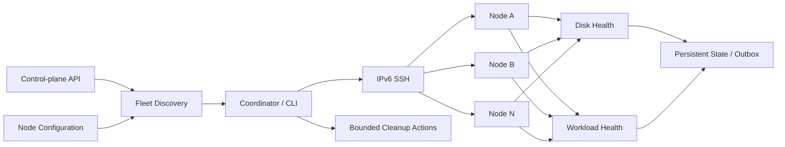

# Edge Fleet Ops Automation

[](#)
[](#)
[](#)
[](#项目状态)

[English](README.md) · **简体中文**

一套面向 Linux 边缘节点集群的状态化运维自动化工具，覆盖节点发现、IPv6 SSH、磁盘健康巡检、工作负载检查、持久化告警状态，以及保守型运维操作。

这个仓库来自一套真实使用过的 Linux edge fleet 运维脚本。原系统处理过动态 IPv6、异构存储、磁盘空间压力、容器健康、定时任务重叠、远程执行，以及重复/噪声告警等实际问题。

公开版本保留核心工程模式，同时移除了生产凭据、设备 ID、内部 API、地点标签、业务方专有信息和生产环境专用修复逻辑。

## 为什么做这个项目

当远程 Linux 节点数量增加后，仅靠“能不能 ping 通”已经不足以判断系统是否健康。不同节点可能使用不同磁盘介质，IPv6 地址会变化，容器可能仍在运行但业务已经异常，cron 任务也可能发生重叠。

因此，这套工具把一个节点拆成几个可以独立检查的部分：**节点发现、远程执行、磁盘健康、工作负载健康、持久化状态，以及有限范围内的运维动作**。公开版本刻意保持保守：默认 dry-run、SSH 只使用密钥认证，并排除高风险的自动修复逻辑。

## 项目展示的能力

- **节点发现：** 通过 control-plane API 将节点标识解析为当前可用 IPv6，并支持静态 fallback。
- **远程运维：** 使用基于密钥的 IPv6 OpenSSH 管理多台 Linux 节点。
- **磁盘健康巡检：** 综合文件系统空间压力与 SMART、NVMe、eMMC 健康信号。
- **工作负载健康：** 结合 Docker 状态、PID、已建立 TCP 连接和 socket 数量判断服务状态。
- **状态化告警：** 持久化状态与 outbox，只在状态变化时产生新告警，并支持恢复事件。
- **定时任务安全：** 提供 bounded job 和适合加锁运行的部署模式。
- **保守型 self-healing：** 公开清理逻辑以 dry-run 为默认，并严格限制操作范围。
- **安全改进：** 公开版本完全移除密码式 SSH 和生产凭据。

## 架构



## 仓库结构

```text
src/edge_fleet_ops/
  control_plane.py      节点发现 / IPv6 候选地址
  ssh.py                基于密钥的远程执行
  disk_health.py        磁盘与文件系统健康分类
  workload_health.py    Docker / socket 工作负载健康分类
  disk_space_guard.py   受限、dry-run-first 的清理逻辑
  outbox.py             持久化原子告警队列
  config.py             节点与环境配置
  cli.py                命令行入口
config/
  nodes.example.json
docs/
  architecture.md
  case-studies.md
  security.md
deployment/
  cron/
tests/
```

## 快速开始

```bash
python3 -m venv .venv
source .venv/bin/activate
pip install -e '.[dev]'
cp .env.example .env
```

在环境变量中配置你自己的 control-plane API 和 SSH key，不要提交 `.env`。

运行测试：

```bash
pytest -q
```

只读检查示例：

```bash
export EDGE_CONTROL_API=https://control.example.invalid/api/nodes
edge-fleet-ops audit-disk --nodes config/nodes.example.json
edge-fleet-ops check-workloads --nodes config/nodes.example.json
```

## 运维设计

### 节点发现与远程执行

节点 IPv6 地址可能变化，因此协调器可以先从 control-plane API 获取当前候选地址，并在必要时使用配置中的 fallback。远程命令使用标准 SSH key 认证，而不是把密码写进脚本。

### 磁盘健康模型

磁盘健康不只是“剩余空间多少”。项目会在可用时综合文件系统压力、SMART、NVMe 和 eMMC 健康指标，使同一套巡检逻辑能够适配不同类型的 edge hardware。

### 工作负载健康模型

Docker 显示 `running` 并不代表业务一定健康。工作负载检查可以同时参考容器状态、进程、已建立 TCP 连接和 socket 数量，得到更有实际意义的服务状态。

### 状态化告警

定时任务如果每轮都对同一个问题重复告警，会迅速产生噪声。项目通过持久化状态和 JSONL 风格 outbox 支持状态变化告警、失败重试和恢复通知。

### 保守型运维

公开版本中的清理逻辑范围刻意保持很小，并默认 dry-run。磁盘格式化、大范围自动修复、业务方专用自动化等高风险私有逻辑均未公开。

## 公开版本与原私有版本

原来的私有工具集中还包含磁盘自动修复、一次性迁移、带宽保护、业务结果核对等高度依赖生产环境的脚本。这些内容没有放入公开仓库。

在整理旧代码时还发现过共享明文 SSH 密码的历史做法。公开版本已彻底移除密码式 SSH，统一改为标准 OpenSSH key。若旧环境中仍有可能有效的凭据，应进行轮换。

## 安全与使用边界

这是一个作品集/参考项目，不是可以直接投入生产的 daemon。如果要改造到其他环境，应重新检查：

- 远程命令与权限边界；
- SSH host key 与密钥管理策略；
- 磁盘阈值和设备类型假设；
- 清理目录与保留策略；
- cron 防重入与超时控制；
- 告警路由和状态文件权限。

更多内容见 [`docs/security.md`](docs/security.md)。

## 项目状态

**Archived / Portfolio Project。** 原部署已经停止或发生变化；这个仓库作为脱敏后的作品集版本保留，用于展示 SRE/DevOps、Linux 系统工程和基础设施自动化能力。